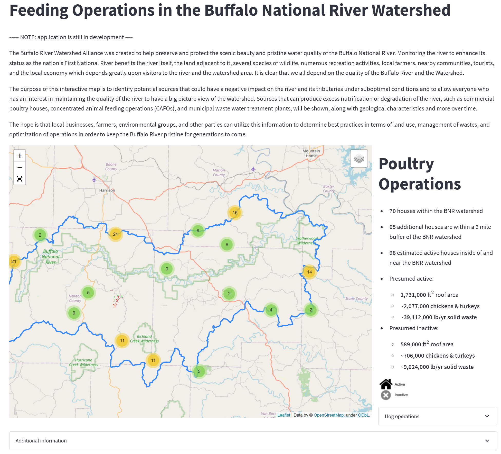

# streamlit-brwa

A streamlit application to share geospatial data and other information on the Buffalo National River and its watershed. This app is maintained by the [Buffalo River Watershed Alliance](https://buffaloriveralliance.org/).

App URL: https://share.streamlit.io/buffalorwa/streamlit-brwa/main/streamlit_app.py

<!-- TABLE OF CONTENTS -->

  
Table of Contents

  <ol>
  <li>
	<li><a href="#about-the-project">About The Project</a></li>
    <li><a href="#contact">Contact</a></li>
    <li><a href="#acknowledgments">Acknowledgments</a></li>
  </li>
  </ol>

<!-- ABOUT THE PROJECT -->
## About The Project

(<a href="#readme-top">back to top</a>)

<!-- CONTACT -->
## Contact

[@twitter_handle](https://twitter.com/twitter_handle) - buffalowatershed@gmail.com

Project Link: [https://github.com/github_username/repo_name](https://github.com/github_username/repo_name)

(<a href="#readme-top">back to top</a>)

<!-- ACKNOWLEDGMENTS -->
## Acknowledgments

* Built after template on [https://github.com/giswqs/streamlit-geospatial](https://github.com/giswqs/streamlit-geospatial)
* 
* 

(<a href="#readme-top">back to top</a>)

